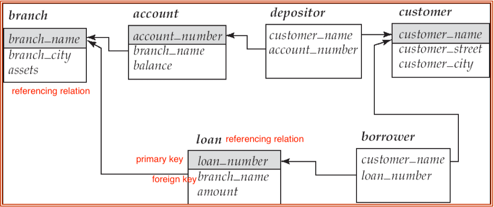

## Course Overview

- **Introduction** 
- **Relational Model**
- SQL
  -  **introduction**
  -  **intermediate**
  -  advanced
- Database Design and Application Design
- Data Storage
- Query Processing 
- Transactions
- Concurrency Control

## 1 - Introduction
- Levels of Abstraction
  - physical level
  - logical level
  - view level
- Schemas and Instances
  - schema: logical structure
  - instance: actual content
- Data Models
  - relational model
  - entity-relationship data model
  - object-based data model
  - semi-structured data model (XML)
- DML (data manipulation language)
  - **declarative (nonprocedural)**: what to do 
  - **procedural**: what to do + how to do
- DDL (data definition language)

## 2 - Relational Model
- A relational database consists of a collection of tables, each of which is assigned a unique name.
- In the relational model, the term **relation** is used to refer to a table, while the term **tuple** is used to refer to a row. Similarly, the term **attribute** refers to a column of a table.

#### Structure
- **tuple**: a tuple is a sequence (or list) of values
- **relation**: a given sets $\{D_1, ..., D_n\}$, a relation $r$ is a **subset** of $D_1 \times \cdots \times D_n$.
- **relation instance**: a specific instance of a relation, i.e., containing a specific set of rows.
- **relation schema**
  - eg. *department (dept name, building, budget)*
  - eg. *teaches (ID, course id, sec id, semester, year)*
<!--  - $r(R)$: a relation $r$ on $R$-->
- **Database**: a database consists of multiple relations, where each relation stores one part of information
- **Keys**
  - attributes for $r$: $A_1, ..., A_n$
  - $R = \{ A_1, ..., A_n \}$
  - **superkey**: $K \subset R$ is a superkey for $r$ if $\forall t_1, t_2 \in r (t_1 \neq t_2)$ we have $t_1.K \neq t_2.K$
  - **candidate key**: minimal superkey
  - **primary key**: a candidate key that is chosen by the database designer as the principal means of identifying tuples within a relation.
  - **foreign key**: a relation schema may have a set of attributes that corresponds to the primary key of another relation. These attributes is called a foreign key.
- **Schema diagram**: 

#### Basic Operations
- select: $\sigma$
  - $\sigma_p(r) = \{ t | t \in r ~and~ p(t)  \}$
- project: $\Pi$
- union: $\cup$
  - conditions: same arity, compatible
  - $r \cup s = \{ t | t \in r ~or~ t \in s \}$
- set difference: $-$
  - conditions: same arity, compatible
  - $r - s = \{ t | t \in r ~and~ t \notin s \}$
- Cartesian product: $\times$
  - $r \times s = \{ t q | t \in r ~and~ q \in s \}$
- rename: $\rho$

#### Additional Operations
- set intersection: $\cap$
  - conditions: same arity, compatible
  - $r \cap s = \{ t | t \in r ~and~ t \in s \}$
  - $r \cap s = r-(r-s)$
- natural join: $\bowtie$
- division: $\div$
- assignment: $\gets$

#### Extended Operations
- generalized projection
  - Extends the projection operation by allowing arithmetic functions to be used in the projection list.
  - $\Pi_{F_1, ..., F_n}(E)$
  - $E$ is relational-algebra expression, and $F_i~(1\leq 1\leq n)$ are arithmetic expressions.
- aggregate functions
  - avg, min, max, sum, count
  - $_{G_1, ..., G_n} g _{F_1(A_1), ..., F_n(A_n)} (E)$
- outer join
  - an extension of the join operation that avoids loss of information.
  - left outer join: $$
  - right outer join
  - full outer join

### Null
- null signifies an unknown value or that a value does not exist

### Modification of the Database
 - deletion: $r \gets r - E$
 - insertion: $r \gets r \cup E$
 - update: $r \gets \Pi_{F_1, ..., F_n} (r)$

## 3, 4, 5 - Intro to SQL (I)(II)(III)

<!--### Data Definition -->

### Basics
- Domain Types in SQL
  - char(n)
  - varchar(n)
  - int
  - smallint
  - numeric(p, d)
  - real, double precision
  - float(n)
- Create Table Construct
  - **create table** r ($A_1, D_1, ..., A_n, D_n$, integrity-constraints)
  - r: name of relation
  - $A_i~(1 \leq i \leq n)$: attribute name
  - $D_i~(1 \leq i \leq n)$: data type of $A_i$
- Integrity constrains
  -  not null
  -  primary key $(A_1, ..., A_n)$
  -  foreign key $(A_i, ..., A_n)$ references r

### Basic Query Structure
- **select** $A_1, ..., A_n$ **from** $r_1, ..., r_n$ **where** $P$
  - $A_1, ..., A_n$: attributes
  - $r_1, ..., r_n$: relation
  - $P$: predicate
- **select**: generalized projection $\Pi$
  - ***SQL allows duplicates in relations as well as in query results***
  - **select distinct**: remove duplicates
  - **select all**: don't remove duplicates
  - **select \***: select all attributes
- **from**: Cartesian product $\times$
- **where**: selection $\sigma$

### Additional Basic Operations
- **natural join**
- rename: **as**
- string operation: **like**
  - % matches any substring
  - _ matches any character
- Ordering the Display of Tuples: **order by** $A_i$ **asc/desc**
- duplicate

### Set Operations
- union
- intersect
- except

### Null Values

### Aggerate Functions

### Nested Subqueries

### Modification of the Database

### Join Expressions

### Views

### Transactions

### Integrity Constraints

### SQL Data Types and Schemas

### Authorization

### Embedded SQL

